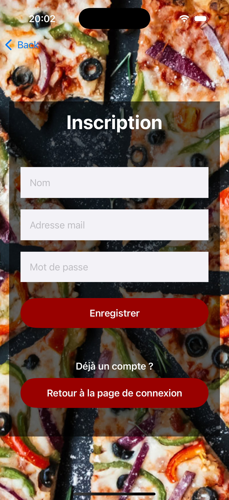
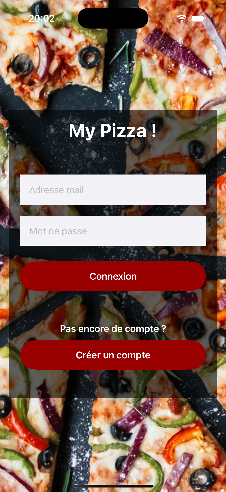
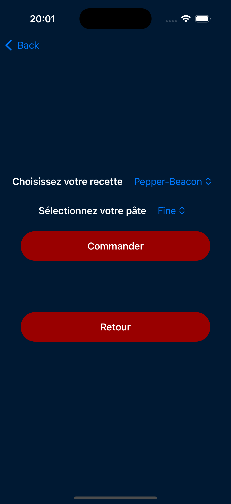
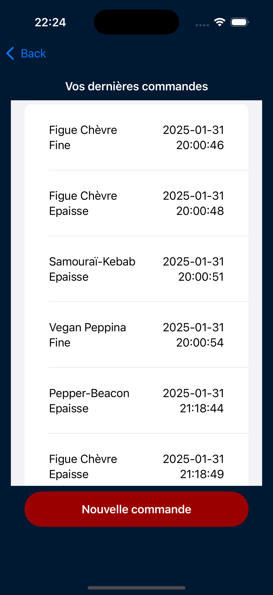

## 🍕 MyPizza

**MyPizza** est une application mobile iOS permettant de commander des pizzas facilement et rapidement. Développée en **SwiftUI** avec une architecture basée sur **REST API**, elle offre une expérience fluide et moderne pour les amateurs de pizza.

---

### 🚀 Fonctionnalités Principales

##### Authentification Utilisateur : 

- Création de compte avec email et mot de passe  
- Connexion sécurisée avec stockage du token d’authentification

*Aperçu :*

<p align="center">
  
  
</p>

---

##### Gestion des Commandes : 

- Passer une commande en quelques clics  
- Consulter l’historique des commandes avec tous les détails

*Aperçu :*

<p align="center">
  
  
</p>

---

### 🛠️ Technologies Utilisées

- **SwiftUI** pour l’interface utilisateur
- **REST API** pour la communication avec le backend
- **Token-based Authentication** pour la sécurité

---

### 💻 Prérequis

- Un **Mac** avec **Xcode** installé (version recommandée : Xcode 15+)
- Un compte développeur Apple pour tester sur un appareil réel

---

### 📁 Installation
1. Clone the repository:
   ```bash  
   git clone https://github.com/hatimbd/MyPizza.git
    ```
2. Ouvrez le projet dans **Xcode**.
3. Exécutez l’application sur un **simulateur iOS** ou un **appareil physique**.  
4. Lancez l’application et **créez un nouveau compte** pour vous connecter et commencer à passer des commandes.